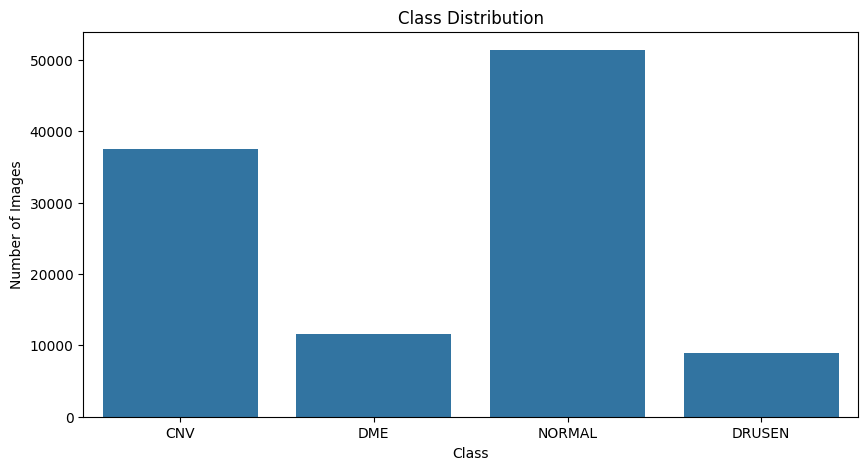
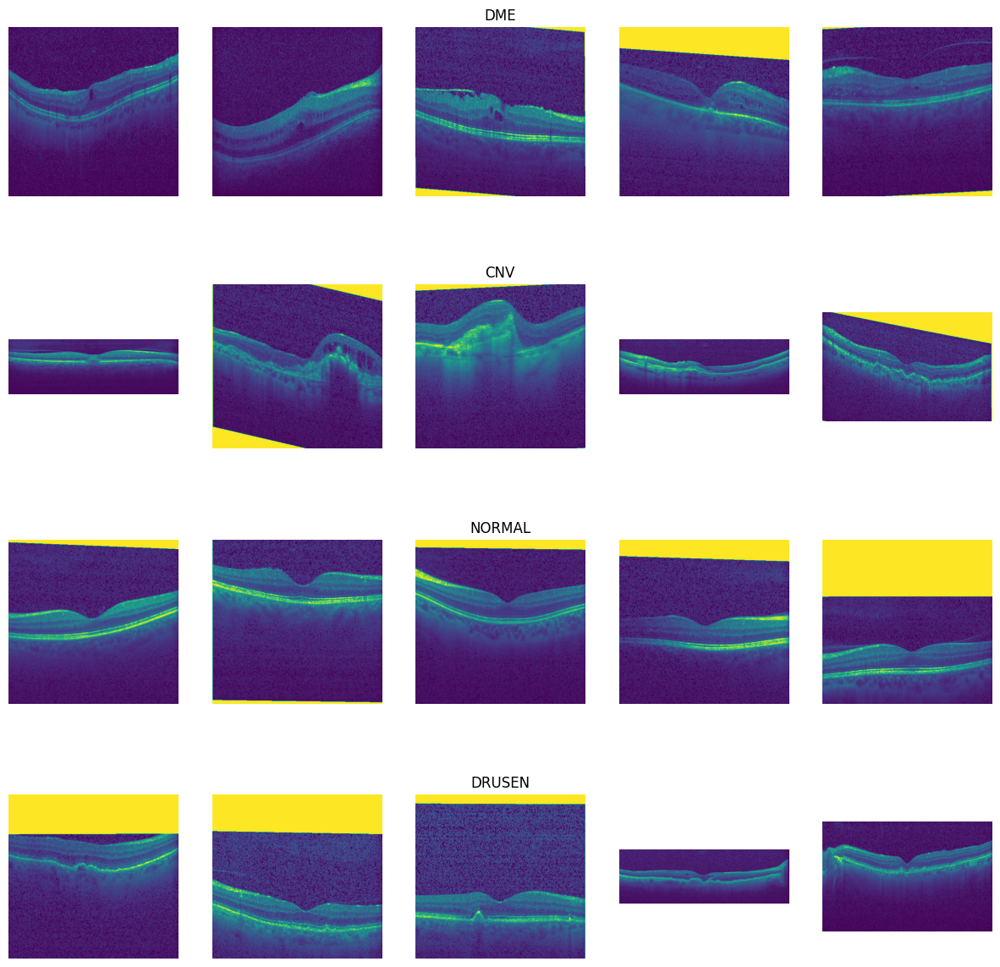
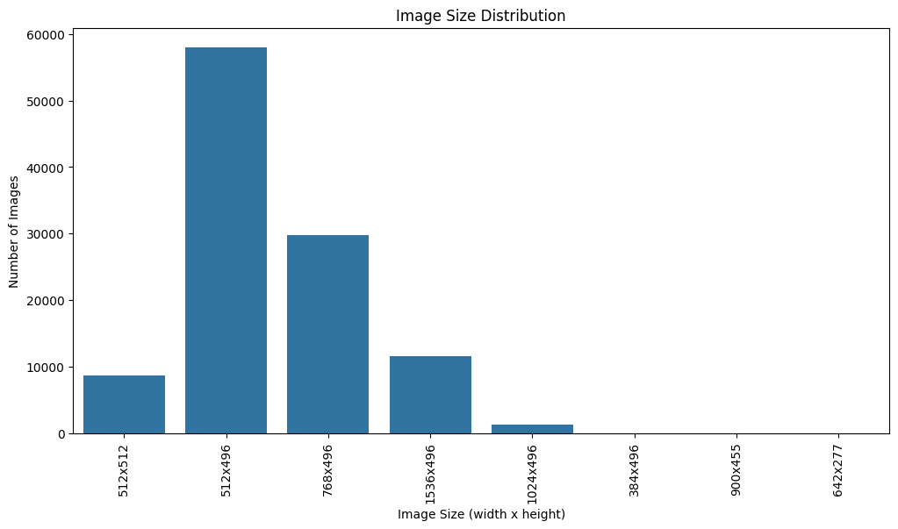
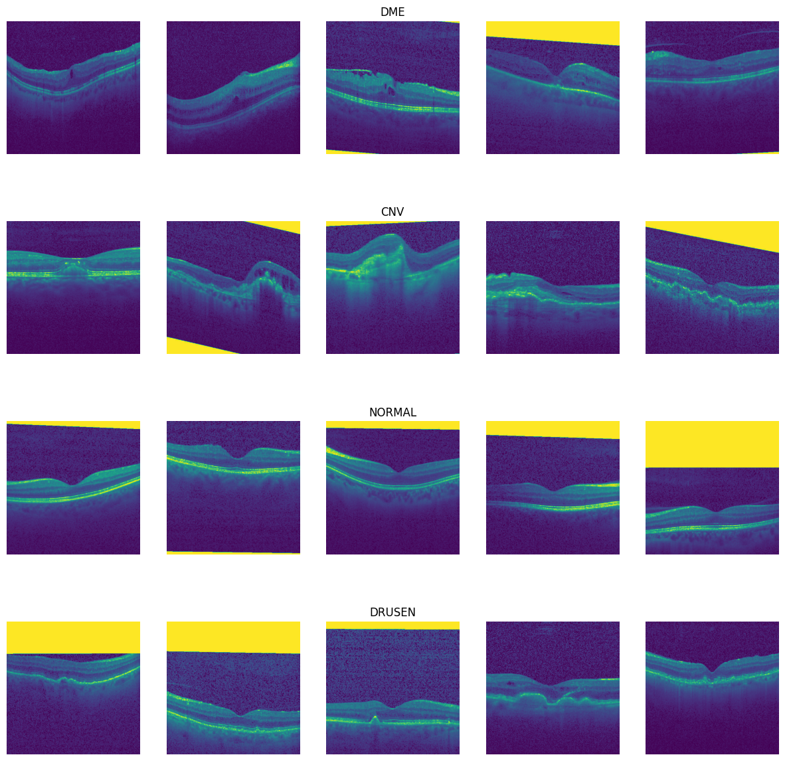
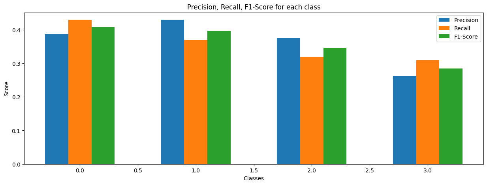
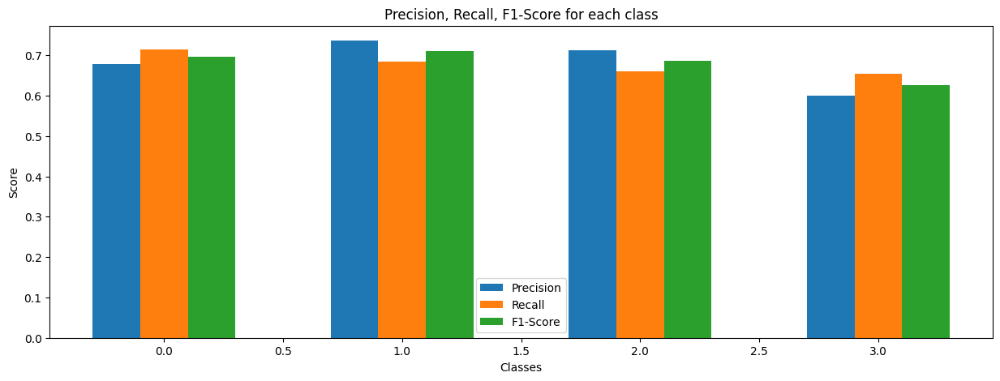
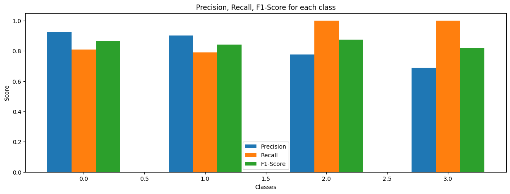

# CSE151A Group Project Final Report

## Team Members
Yiju Li, yil125@ucsd.edu
Charles Choi, dicai@ucsd.edu

## Abstraction
In recent years, the integration of advancements in medical imaging technology and machine learning has brought unprecedented innovation to medical diagnostics. Our team project aims to develop a machine learning model to classify Optical Coherence Tomography (OCT) images into four categories: Choroidal Neovascularization (CNV), Diabetic Macular Edema (DME), Drusen, and Normal. By utilizing a comprehensive dataset of OCT images, we hope to improve the accuracy and efficiency of diagnosing these retinal conditions. This project was chosen to address the pressing need for efficient diagnostic tools in ophthalmology, reduce the burden on medical professionals, and provide better care for patients. This project demonstrates the immense potential of artificial intelligence in medical diagnostics, offering not only technical innovation but also the ability to broadly improve public health, especially in areas with limited medical resources. Our goal is to advance medical imaging technology and contribute to better global health outcomes through information technology.

## Introduction

This project was chosen because of the increasing demand for innovative and efficient diagnostic tools in the field of ophthalmology. Traditional methods of diagnosing retinal conditions can be time-consuming and require significant expertise. By applying machine learning to OCT images, we aim to develop a model that can assist ophthalmologists in making quicker and more accurate diagnoses. This not only reduces the burden on healthcare professionals but also enhances patient care through timely treatment.The integration of machine learning with medical imaging is one of the most exciting areas in modern healthcare. Developing a model that can accurately classify OCT images is a prime example of technology solving real-world problems. This project is particularly cool because it showcases the potential of artificial intelligence to transform medical diagnostics, making cutting-edge technology practical and feasible in everyday clinical settings.

The broader impact of having a reliable OCT image classification predictive model cannot be overstated. Early and accurate diagnosis of retinal conditions such as CNV, DME, and Drusen is crucial for effective treatment and prevention of vision loss. A robust machine learning model can significantly enhance diagnostic accuracy, leading to better patient outcomes. Moreover, it can alleviate the workload of ophthalmologists, allowing them to focus on more complex cases and reducing overall healthcare costs。 Additionally, such a model can be deployed in regions with limited access to specialized healthcare providers, democratizing access to quality eye care. By providing a reliable diagnostic tool, we can improve the quality of life for individuals globally, particularly in underserved areas.

We are utilizing a large dataset of labeled Optical Coherence Tomography (OCT) images. This dataset was published on June 1, 2018. The main contributors include Daniel Kermany, Kang Zhang, and Michael Goldbaum. This dataset contains thousands of validated OCT images, which were described and analyzed in the paper "Identifying Medical Diagnoses and Treatable Diseases by Image-Based Deep Learning."To ensure accuracy, we have downloaded the latest version of this dataset. The images in the dataset are divided into training and testing sets and grouped by independent patients. The image labels follow the format "disease-randomized patient ID-image number by this patient" and are split into four directories: CNV, DME, DRUSEN, and NORMAL. By using this large and well-labeled dataset, our project aims to improve the training and testing accuracy of the model while ensuring good generalization across different patients. This will further validate the effectiveness of our machine learning model and promote its application in actual medical diagnostics.

## Methods
### Data Exploration

The dataset consists of images classified into different categories. Image paths and corresponding labels were collected by traversing the directory structure of the dataset. This allowed for determining the total number of images and the number of distinct classes.

```python
image_paths, labels = get_image_paths_and_labels(dataset_path)

num_images = len(image_paths)
num_classes = len(set(labels))
```

The distribution of images across the classes was counted and visualized using a bar plot to provide an overview of the class distribution.

```python
class_distribution = Counter(labels)

plt.figure(figsize=(10, 5))
sns.barplot(x=list(class_distribution.keys()), y=list(class_distribution.values()))
plt.title('Class Distribution')
plt.xlabel('Class')
plt.ylabel('Number of Images')
plt.show()
```

Example images from each class were displayed to provide a visual understanding of the dataset's content. Five images from each class were selected and plotted.

```python
def plot_example_images(image_paths, labels, class_distribution, num_examples=5):
    plt.figure(figsize=(15, 15))
    for i, cls in enumerate(class_distribution.keys()):
        cls_images = [image_paths[j] for j in range(len(image_paths)) if labels[j] == cls]
        for j in range(num_examples):
            img = Image.open(cls_images[j])
            plt.subplot(len(class_distribution), num_examples, i * num_examples + j + 1)
            plt.imshow(img)
            plt.axis('off')
            if j == num_examples // 2:
                plt.title(cls)
    plt.show()

plot_example_images(image_paths, labels, class_distribution)
```

The sizes of the images in the dataset were analyzed by extracting the dimensions of each image. The frequency of each image size was then counted. The distribution of image sizes was visualized using a bar plot.

```python
image_sizes = [Image.open(img_path).size for img_path in image_paths]
size_distribution = Counter(image_sizes)

plt.figure(figsize=(12, 6))
sizes, counts = zip(*size_distribution.items())
sizes = [f"{size[0]}x{size[1]}" for size in sizes]
sns.barplot(x=sizes, y=counts)
plt.title('Image Size Distribution')
plt.xlabel('Image Size (width x height)')
plt.ylabel('Number of Images')
plt.xticks(rotation=90)
plt.show()
```

### Data Preprocessing:
Images were preprocessed by cropping them to a specific size. This involved defining a target size and then cropping each image from the center to match this target size. The cropped images were then saved back to their original paths.

Then, the xample images were plotted again after cropping to verify the preprocessing step.

The next step in preprocessing was to convert the images into tensors suitable for model training. This was done using TensorFlow's ImageDataGenerator, which also rescaled the images. Images were loaded from directories, resized to the target size, converted to grayscale, and then transformed into tensors.

```python
data_gen = ImageDataGenerator(rescale=1./255)
data_flow = data_gen.flow_from_directory(
   directory,
   target_size=(496, 496),
   color_mode='grayscale',
   batch_size=32,
   class_mode='sparse'
)
```

### Model 1:

The first model was a simple CNN designed to classify the images into four classes. The model architecture consisted of the following layers:

- **Convolutional Layer 1:** 32 filters, 3x3 kernel size, ReLU activation function, input shape of 496x496x1 (grayscale images).
- **Max Pooling Layer 1:** 2x2 pool size.
- **Convolutional Layer 2:** 64 filters, 3x3 kernel size, ReLU activation function.
- **Max Pooling Layer 2:** 2x2 pool size.
- **Flatten Layer:** Flattened the 2D matrices into 1D vectors.
- **Dense Layer:** 4 neurons with a softmax activation function for the output layer.

The model was compiled with the Adam optimizer, sparse categorical cross-entropy loss, and accuracy as the evaluation metric.

### Model 2:

The second model was a more complex Convolutional Neural Network (CNN) designed to classify the images into four classes. The model architecture consisted of the following layers:

- **Convolutional Layer 1:** 32 filters, 3x3 kernel size, ReLU activation function, input shape of 496x496x1 (grayscale images).
- **Max Pooling Layer 1:** 2x2 pool size.
- **Convolutional Layer 2:** 64 filters, 3x3 kernel size, ReLU activation function.
- **Max Pooling Layer 2:** 2x2 pool size.
- **Convolutional Layer 3:** 128 filters, 3x3 kernel size, ReLU activation function.
- **Max Pooling Layer 3:** 2x2 pool size.
- **Convolutional Layer 4:** 128 filters, 3x3 kernel size, ReLU activation function.
- **Max Pooling Layer 4:** 2x2 pool size.
- **Flatten Layer:** Flattened the 2D matrices into 1D vectors.
- **Dense Layer 1:** 512 neurons with a ReLU activation function.
- **Dense Layer 2:** 4 neurons with a softmax activation function for the output layer.

The model was compiled with the Adam optimizer, sparse categorical cross-entropy loss, and accuracy as the evaluation metric.


This model introduced additional convolutional and pooling layers, as well as a larger dense layer, compared to Model 1.

### Model 3

The third model was a more advanced Convolutional Neural incorporating additional regularization techniques to improve performance and prevent overfitting. The model architecture consisted of the following layers:

- **Convolutional Layer 1:** 32 filters, 3x3 kernel size, ReLU activation function, input shape of 496x496x1 (grayscale images).
- **Max Pooling Layer 1:** 2x2 pool size.
- **Batch Normalization Layer 1:** Normalizes the activations of the previous layer.
- **Dropout Layer 1:** Drops 25% of the input units to prevent overfitting.
- **Convolutional Layer 2:** 64 filters, 3x3 kernel size, ReLU activation function.
- **Max Pooling Layer 2:** 2x2 pool size.
- **Batch Normalization Layer 2:** Normalizes the activations of the previous layer.
- **Dropout Layer 2:** Drops 25% of the input units to prevent overfitting.
- **Convolutional Layer 3:** 128 filters, 3x3 kernel size, ReLU activation function.
- **Max Pooling Layer 3:** 2x2 pool size.
- **Batch Normalization Layer 3:** Normalizes the activations of the previous layer.
- **Dropout Layer 3:** Drops 25% of the input units to prevent overfitting.
- **Convolutional Layer 4:** 128 filters, 3x3 kernel size, ReLU activation function.
- **Max Pooling Layer 4:** 2x2 pool size.
- **Batch Normalization Layer 4:** Normalizes the activations of the previous layer.
- **Dropout Layer 4:** Drops 25% of the input units to prevent overfitting.
- **Flatten Layer:** Flattened the 2D matrices into 1D vectors.
- **Dense Layer 1:** 256 neurons with a ReLU activation function.
- **Batch Normalization Layer 5:** Normalizes the activations of the previous layer.
- **Dropout Layer 5:** Drops 50% of the input units to prevent overfitting.
- **Dense Layer 2:** 4 neurons with a softmax activation function for the output layer.

The model was compiled with the Adam optimizer, sparse categorical cross-entropy loss, and accuracy as the evaluation metric.

## Results
### Data Exploration
- Class Distribution

- Example Pictures

- Image size distribution


### Data Preprocessing
- After cropping


### Model 1

| Class | Precision | Recall | F1-Score | Support |
|-------|-----------|--------|----------|---------|
| 0     | 0.39      | 0.43   | 0.41     | 200     |
| 1     | 0.43      | 0.37   | 0.40     | 200     |
| 2     | 0.38      | 0.32   | 0.35     | 200     |
| 3     | 0.26      | 0.31   | 0.28     | 200     |

| Metric     | Value |
|------------|-------|
| Accuracy   | 0.36  |
| Macro Avg  | 0.36  |
| Weighted Avg | 0.36 |



- Precision, recall, and F1-scores were relatively low across all classes.
- The overall accuracy was 36%.

### Model 2

| Class | Precision | Recall | F1-Score | Support |
|-------|-----------|--------|----------|---------|
| 0     | 0.68      | 0.71   | 0.70     | 200     |
| 1     | 0.74      | 0.69   | 0.71     | 200     |
| 2     | 0.71      | 0.66   | 0.69     | 200     |
| 3     | 0.60      | 0.66   | 0.63     | 200     |

| Metric     | Value |
|------------|-------|
| Accuracy   | 0.68  |
| Macro Avg  | 0.68  |
| Weighted Avg | 0.68 |



- Precision, recall, and F1-scores improved significantly compared to Model 1.
- The overall accuracy was 68%.

### Model 3

| Class | Precision | Recall | F1-Score | Support |
|-------|-----------|--------|----------|---------|
| 0     | 0.92      | 0.81   | 0.86     | 200     |
| 1     | 0.90      | 0.79   | 0.84     | 200     |
| 2     | 0.78      | 1.00   | 0.87     | 200     |
| 3     | 0.69      | 1.00   | 0.82     | 200     |

| Metric     | Value |
|------------|-------|
| Accuracy   | 0.85  |
| Macro Avg  | 0.85  |
| Weighted Avg | 0.85 |



- Precision, recall, and F1-scores were highest among the three models.
- The overall accuracy was 85%.

## Discussion

### Data Exploration

In the data exploration stage, we first understood the basic characteristics of the dataset, including the number of images, the number of classes, and the class distribution. This step is crucial for subsequent preprocessing and model selection because it helps us identify any potential issues in the dataset, such as class imbalance. During exploration, we found that the class distribution was relatively even, meaning our model would not require extensive adjustments to handle class imbalance. Additionally, by displaying example images for each class, we gained a more intuitive understanding of the data's characteristics and variability.

### Data Preprocessing

In the data preprocessing stage, we primarily performed image cropping and tensor conversion. Image cropping resized all images to a consistent size (496x496 pixels), which is essential for ensuring consistency in the data fed into the model. Tensor conversion transformed the image data into a format that the model can process and included normalization. This step is critical because the quality of input data directly affects the model's performance. Through cropping and normalization, we ensured data consistency and standardization, laying a solid foundation for model training.

### Model 1

Model 1 is a simple Convolutional Neural Network (CNN) consisting of two convolutional layers and one fully connected layer. Although the model architecture is simple, it failed to effectively capture the data's complexity, resulting in low precision, recall, and F1 scores across all classes. This indicates that Model 1 is underfitting, as its structure is too simple to adequately learn and represent the patterns and features in the data.

### Model 2

Model 2's design is more complex than Model 1, incorporating additional convolutional and pooling layers. We made these changes to better capture detailed features in the images. By adding more convolutional and pooling layers, we aimed to extract more complex and abstract features, thereby improving the model's classification capability. Model 1's poor performance was primarily due to its overly simple structure, which could not adequately represent the data's patterns. By increasing the complexity of the model with more layers, we endowed it with greater expressive power.

The outcomes of these changes were evident in the significant improvement in performance metrics, such as precision, recall, and F1 scores, compared to Model 1. The additional layers enabled Model 2 to classify more accurately. Moreover, the extra convolutional layers allowed the model to extract more hierarchical features, leading to a better understanding of the image content. Convolutional layers work by capturing various local features through different filters (convolution kernels) scanning the input image. These features are then passed and combined through layers, forming a global understanding of the image. Additionally, pooling layers reduce the size of feature maps through subsampling while retaining important features. This not only reduces the computational load but also enhances the model's translational invariance, making it more robust to changes in image position.

### Model 3

Building on Model 2, Model 3 further incorporates batch normalization and dropout layers to enhance performance and stability. Introducing batch normalization accelerates the training process, stabilizes model training, and reduces internal covariate shift. Adding dropout layers, a regularization technique, helps prevent overfitting by randomly dropping a proportion of neurons during training, thus enhancing the model's generalization ability.

The outcomes of these changes include increased model stability and enhanced generalization. Batch normalization helped accelerate training and made the training process more stable. Dropout layers prevented the model from over-relying on certain features by randomly dropping neurons, which improved its performance on unseen data. The significant performance improvement was reflected in Model 3 achieving an accuracy of 85%, a further enhancement over Model 2, indicating that these modifications substantially boosted the model's performance.

Batch normalization works by normalizing the activations at each layer, maintaining stable output mean and variance, and reducing the variation in input distribution between layers. This accelerates training and enhances model stability. Dropout, on the other hand, prevents neurons from over-relying on their neighbors by randomly dropping them during training. This process forces the model to learn more robust features, increasing randomness and preventing overfitting, thereby improving generalization.

### Discussion

Although Model 3 significantly outperformed the other models, several factors should still be considered.

First, the size and diversity of the dataset significantly impact model performance. If the dataset is small or lacks diversity, it may result in insufficient model generalization. A model trained on a limited dataset may not capture the full range of variability in real-world data, leading to suboptimal performance when exposed to new, unseen data.

Second, while increasing model complexity can enhance performance, it also requires more training time and computational resources. Complex models with many layers and parameters take longer to train and demand more powerful hardware. Additionally, overly complex models may perform poorly on different datasets. Such models can become highly specialized to the training data and may not generalize well to other datasets with different characteristics, leading to overfitting.

Finally, despite the current model's good performance, future improvements may require the introduction of more advanced techniques to further enhance performance. Techniques such as transfer learning, where a model pre-trained on a large dataset is fine-tuned on a smaller, task-specific dataset, can significantly boost performance. Additionally, data augmentation, which involves generating new training samples by applying transformations to the existing data, can help improve model robustness and generalization. These advanced methods can address some of the limitations of the current approach and lead to even better results. We also plan to incorporate data augmentation in the future to extend the number training dataset available, which might reduce overfitting and improve accuracy and sensitivity, which is another metric that we plan to optimize on.

### Conclusion
Through the development and refinement of our convolutional neural network models, we have demonstrated the significant potential of artificial intelligence in medical diagnostics. Model 3, our most advanced model, achieved the highest accuracy, showcasing the importance of incorporating advanced techniques such as batch normalization and dropout for enhanced performance and generalization.

Despite these promising results, there are areas for future improvement. Expanding the dataset and incorporating transfer learning and data augmentation could further enhance model robustness and accuracy. Additionally, exploring other advanced architectures and fine-tuning hyperparameters will likely yield even better results.

This project was conducted as part of CSE151A, a course that has profoundly impacted our understanding and application of machine learning. The knowledge and skills acquired in this course were instrumental in the successful execution of this project. CSE151A has not only equipped us with the technical expertise needed to develop sophisticated machine learning models but also inspired us to explore the transformative possibilities of AI in real-world applications. We are grateful for the guidance and support provided by our Prof. Edwin Solares, TAs and peers throughout this course. 

### Statement of Contribution
- Yiju Li: data selection, modeling, model evaluation
- Charles Choi: processing, model evaluation

Both Yiju Li and Charles Choi worked collaboratively on all aspects of the project. Each member actively participated in coding, data analysis, writing, and providing feedback.

### Link to all codes
All code has been uploaded in the form of Jupyter notebooks in the `notebooks` folder under the root directory in this repository.
